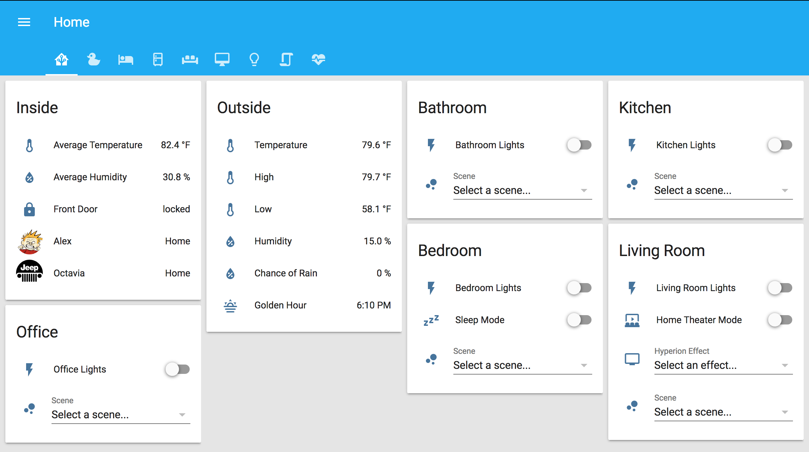

# Home Assistant
Example [Home Assistant](https://home-assistant.io/) Configs

Home Assistant Version: 0.48.0

# Devices
* [Aeotec Multisensor 6](https://www.amazon.com/gp/product/B0151Z8ZQY/) x4
* [Aeotec Z-Stick Gen5](https://www.amazon.com/gp/product/B00X0AWA6E/)
* [Amazon Echo](https://www.amazon.com/Amazon-Echo-Bluetooth-Speaker-with-Alexa-Black/dp/B00X4WHP5E/) x2
* [Amazon Echo Dot (2nd Generation)](https://www.amazon.com/Amazon-Echo-Dot-Portable-Bluetooth-Speaker-with-Alexa-White/dp/B015TJD0Y4/)
* [Apple TV (4th Generation)](https://www.apple.com/apple-tv/)
* [August Connect](http://august.com/products/august-connect/)
* [August Smart Lock](http://august.com/products/august-smart-lock/)
* [Denon AVR-X1200W 7.2 Channel AV Receiver](https://www.amazon.com/Denon-AVR-X1200W-Channel-Receiver-Bluetooth/dp/B00ZY7FHXY/)
* [Denon AVR-X4300H 9.2 Channel AV Receiver](https://www.amazon.com/Denon-AVRX4300H-technology-featuring-Bluetooth/dp/B01KZRPNIQ/)
* [Estimote Proximity Beacons](https://www.amazon.com/gp/product/B01M7SREI7/) x3
* [Flic Button](https://flic.io/) x4 *via Flic SDK for Linux*
* [LIFX (A19) Wi-Fi Smart LED Light Bulb](https://www.amazon.com/gp/product/B01M7SREI7/) x9 *via Emulated Hue*
* [LIFX (BR30) Wi-Fi Smart LED Light Bulb](https://www.amazon.com/gp/product/B01KY02MPG/) x5 *via Emulated Hue*
* [TRENDnet Low Energy Micro Bluetooth 4.0 Class I USB 2.0](https://www.amazon.com/gp/product/B002AQSTXM/)

# Hardware
* [Supermicro Atom Server SYS- 5015A-EHF-D525](https://www.supermicro.com/products/system/1U/5015/SYS-5015A-EHF-D525.cfm)
* [Supermicro Dual Xeon L5640 RAID Server](http://www.supermicro.com/products/motherboard/QPI/5500/X8DTU-F.cfm)
* [Ubiquiti Networks - UniFi AP AC PRO](https://www.amazon.com/gp/product/B015PRO512/)
* [Ubiquiti Networks - UniFi Switch 16-150W](https://www.amazon.com/gp/product/B01E46ATQ0/)
* [Ubiquiti Networks - UniFi Switch 8-150W](https://www.amazon.com/gp/product/B01DKXT4CI/)

# Software
* [CloudMQTT](https://www.cloudmqtt.com/)
* [Docker](https://www.docker.com/)
* [Flic SDK for Linux](https://github.com/50ButtonsEach/fliclib-linux-hci) *via Docker container*
* [Home Assistant](https://home-assistant.io/) *via Docker container*
* [Homebridge](https://github.com/nfarina/homebridge) *via Docker container*
* [Owntracks](http://owntracks.org/) *via CloudMQTT*
* [Plex Media Server](https://www.plex.tv/) *via Docker container*

# Interface

