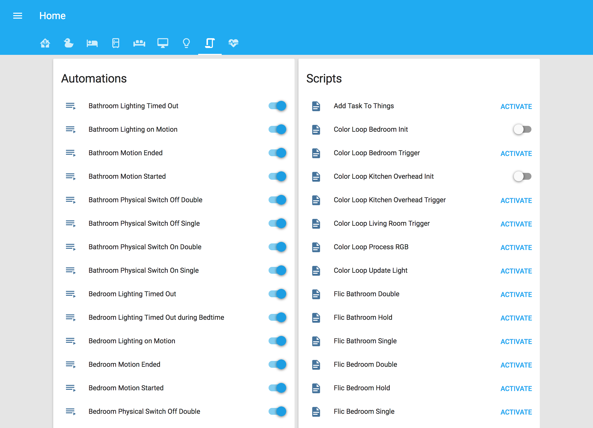

# Home Assistant
[Home Assistant](https://home-assistant.io/) Version: Latest

# Devices
* [Aeotec Z-Stick Gen5](https://www.amazon.com/gp/product/B00X0AWA6E/)
* [Aeotec MultiSensor 6](https://www.amazon.com/gp/product/B0151Z8ZQY/) x4
* [Aeotec TriSensor](https://www.amazon.com/gp/product/B07GP3ZCYD/)
* [Honeywell IS3035 PIR Motion Detector](https://www.amazon.com/gp/product/B0182QLPYI/) x2
* [Ecolink Z-wave Plus Motion Detector](https://www.amazon.com/gp/product/B01MQXXG0I/)
* [Sensative Z-Wave Plus Ultra Thin Door/Window Contact Sensor Strips](https://www.amazon.com/gp/product/B01LWMTUI8/) x4
* [FortrezZ MIMOlite](https://www.amazon.com/gp/product/B00B6RZ7MM/)
* [Konnected Alarm Panel Wired Alarm System Conversion Kit](https://konnected.io/collections/in-stock-now/products/konnected-alarm-panel-wired-alarm-system-conversion-kit)
* [August Connect](http://august.com/products/august-connect/)
* [August Smart Lock Pro](https://www.amazon.com/gp/product/B0765LFNM7/) x2
* [Estimote Proximity Beacons](https://www.amazon.com/gp/product/B01M7SREI7/) x3
* [HomeSeer HS-WS100+ Wall Switch](https://www.amazon.com/gp/product/B01DFSAAJ4/) x5
* [HomeSeer HS-WD200+ Wall Dimmer](https://www.amazon.com/gp/product/B079F38TPF/) x8
* [GE Enbrighten Z-Wave Plus Smart Receptacle Outlet](https://www.amazon.com/gp/product/B07361JZ2H/)
* [LIFX Z Multi Color LED Light Strip](https://www.amazon.com/gp/product/B073168F4Y/) x3 *via Emulated Hue & HomeKit*
* [Nest Thermostat E](https://store.google.com/us/product/nest_thermostat_e?hl=en-US) x2
* [Apple TV (4th Generation)](https://www.apple.com/apple-tv/)
* [Amazon Echo](https://www.amazon.com/gp/product/B00X4WHP5E/) x3
* [Sonos One](https://www.amazon.com/gp/product/B074XN1LH3/) x4
* [Sonos Amp](https://www.amazon.com/gp/product/B07LD8NN37/) x2
* [Neato Robotics Botvac Connected D7](https://www.amazon.com/gp/product/B07KGMCLPX/) x2
* [Automatic Connected Car Assistant](https://www.amazon.com/gp/product/B07P37K3VG/)
* [Samsung Electronics Galaxy Tab A, 10.5"](https://www.amazon.com/gp/product/B07FM86283/) x3 *TileBoard Dashboard Displays*

# Hardware
* [Supermicro Atom Server](https://www.supermicro.com/products/system/1U/5015/SYS-5015A-EHF-D525.cfm) *for Home Assistant*
* [Supermicro Dual Xeon L5640 RAID Server](http://www.supermicro.com/products/motherboard/QPI/5500/X8DTU-F.cfm) *for Plex Media Server*
* [Supermicro Xeon E3-1220 Server](https://www.supermicro.com/products/motherboard/Xeon/C202_C204/X9SCL_-F.cfm) *for pfSense*
* [NETGEAR ReadyNAS (RN3138)](https://www.amazon.com/gp/product/B017NMX5KO/) *for Plex Media*
* [Ubiquiti Networks - UniFi Cloud Key Gen2 Plus](https://www.amazon.com/gp/product/B07HLLC1TC/)
* [Ubiquiti Networks - UniFi AP AC PRO](https://www.amazon.com/gp/product/B015PRO512/) x2
* [Ubiquiti Networks - UniFi Switch 16-150W](https://www.amazon.com/gp/product/B01E46ATQ0/)
* [Ubiquiti Networks - UniFi Switch 8-150W](https://www.amazon.com/gp/product/B01DKXT4CI/) x2
* [Ubiquiti Networks - Unifi UVC-G3](https://www.amazon.com/gp/product/B01EZYTYLC/)
* [Ubiquiti Networks - UniFi Video G3 Camera](https://www.amazon.com/gp/product/B077QCR56S/) x3
* [Ubiquiti Networks - UniFi Video G3-Micro Wireless Camera](https://www.amazon.com/gp/product/B077H91CM7/)
* [Ring Video Doorbell Pro](https://www.amazon.com/gp/product/B01DM6BDA4/)

# Software
* [Docker](https://www.docker.com/)
* [Home Assistant](https://home-assistant.io/)
* [MariaDB](https://mariadb.org/)
* [NGINX](https://www.nginx.com/)
* [TileBoard](https://github.com/resoai/TileBoard)
* [Fully Kiosk Browser](https://www.ozerov.de/fully-kiosk-browser/)
* [Sonos TTS Addon](https://github.com/kevinvincent/hassio-addons/tree/master/sonos-audioclip-tts)
* [webNUT](https://github.com/rshipp/webNUT)
* [Telegraf](https://www.influxdata.com/time-series-platform/telegraf/)
* [InfluxDB](https://www.influxdata.com/time-series-platform/influxdb/)
* [Grafana](https://grafana.com/)
* [Plex Media Server](https://www.plex.tv/)
* [Tautulli](https://tautulli.com/)
* [Geofency](https://www.geofency.com/)

<!--
# Interface

-->
